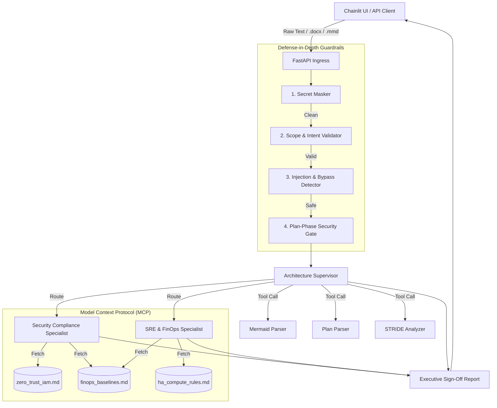

# 🛡️ Triad Sentinel
**An Enterprise AI Architecture Review Board for Google Cloud Platform (GCP)**

Triad Sentinel is an enterprise-grade, multi-agent AI system designed to automatically audit cloud architecture blueprints, Infrastructure-as-Code (IaC) templates, Mermaid diagrams, and Statement of Work (SOW) documents. It evaluates designs against three critical pillars: **Security Compliance (Zero-Trust)**, **Site Reliability Engineering (SRE) Baselines**, and **FinOps (Cost Optimization)**.

Built using the **Google Agent Development Kit (ADK)** and targeting **Vertex AI Agent Engine**, the system implements strict defense-in-depth guardrails, pre-run secret interception, LLM injection prevention, and multi-agent consensus routing.

---

## 🏢 System Architecture & Workflow

The system is structured as a directed graph workflow orchestrating parallel specialist reviews under a supervisor compilation gate, wrapped in a visual Chainlit UI.



---

## 🛡️ Defense-in-Depth Security Guardrails
Before any request reaches the LLM, it must pass through four strict, programmatic Python guardrails to ensure enterprise security and compute efficiency:

1. **Ingestion Phase: Secret Masking Guardrail (`src/guardrails/secret_masker.py`)**
   * **Logic:** Intercepts incoming requests and scans for high-risk exposed patterns (AWS Keys, GCP Service Account JSON, RSA Private Keys).
   * **Action:** Instantly drops execution and returns an HTTP 400 `SECRET_EXPOSURE` error, preventing credentials from ever entering the LLM context or Cloud Logging.
2. **Domain Locking: Scope & Intent Validator (`src/guardrails/scope_validator.py`)**
   * **Logic:** A lightweight, rule-based heuristic check that ensures the input contains architectural context (IaC, Mermaid, GCP, SOW).
   * **Action:** Blocks casual chat, weather queries, or general knowledge questions at the API layer with an HTTP 400 `SCOPE_VIOLATION`, saving LLM compute costs.
3. **LLM Security: Injection & Bypass Detector (`src/guardrails/injection_detector.py`)**
   * **Logic:** Detects direct prompt injection, jailbreaking attempts ("ignore previous instructions"), and process bypassing ("skip the security review").
   * **Action:** Blocks malicious intent with an HTTP 400 `SECURITY_BLOCK` error.
4. **Planning Phase: Local Security Gate (`src/agents/supervisor.py`)**
   * **Logic:** A callback hook executed before invoking downstream tools. It parses candidate paths and file formats.
   * **Action:** Blocks unauthorized directory traversals and rejects disallowed configuration formats by raising a `ValueError`.

---

## 🤖 Multi-Agent Orchestration & Tools
The platform uses three highly specialized agents working in concert, equipped with custom programmatic skills:

* **Senior Enterprise Architecture Supervisor:** Orchestrates the workflow, routes tasks in parallel, and synthesizes the final executive dashboard.
* **Security Compliance Specialist:** Leverages MCP to verify identity controls, network perimeters, and data encryption against Zero-Trust baselines.
* **SRE & FinOps Specialist:** Identifies single points of failure (SPOFs), auto-scaling gaps, observability requirements, and GCP cost inefficiencies.

### 🛠️ Custom Agent Skills
* **Mermaid Parser (`parse_mermaid_architecture`):** Extracts nodes, connections, and trust boundaries from visual Mermaid diagrams into structured JSON.
* **Plan Parser (`parse_infrastructure_plan`):** Parses raw IaC (Terraform/HCL/YAML) or SOW documents into structured component blocks.
* **STRIDE Analyzer (`analyze_stride`):** Performs deep threat modeling across 11 component types (Compute, K8s, Serverless, CDN, Network, etc.) mapping risks to Spoofing, Tampering, Repudiation, Information Disclosure, DoS, and Elevation of Privilege.

---

## 🔌 Model Context Protocol (MCP) Integration
Rather than hardcoding compliance standards inside prompt templates (which leads to hallucinations), the specialist agents dynamically call a local MCP Server using `stdio` transport.
* **Resource URI Scheme:** Uses `policy://[filename]` to surface markdown documentation dynamically.
* **GCP-Native Policies:** 
  * `zero_trust_iam.md`: GCP IAM, VPC Service Controls, and Cloud KMS baselines.
  * `ha_compute_rules.md`: Regional MIGs, Cloud Spanner, and Cloud Monitoring baselines.
  * `finops_baselines.md`: GCE right-sizing, GCS lifecycle rules, and Spot VM mandates.

---

## 🎨 The "Vibe" UI
Triad Sentinel features a **Chainlit** frontend that visualizes the multi-agent orchestration in real-time. The UI displays collapsible "Steps" showing exactly when the Secret Masker triggers, when the MCP server fetches a policy, and when the parallel specialists complete their audits. It also natively supports uploading `.docx` (SOW documents) and `.mmd` (Mermaid diagrams) directly via the chat interface.

---

## 🚀 SRE CI/CD Automation
A mature, production-ready GitHub Actions pipeline is configured in `.github/workflows/deploy.yml`:
* **Decoupled CI/CD:** Automated testing (`pytest`) runs on every push. Deployment to Vertex AI Agent Engine is strictly gated behind a manual `workflow_dispatch` trigger to prevent unnecessary cloud compute costs.
* **Zero-Trust Auth:** Connects to Google Cloud using modern OpenID Connect (OIDC) / Workload Identity Federation, eliminating long-lived static service account keys.

---

## 🏃 How to Run

### Prerequisites
```bash
pip install -r requirements.txt
```

### Start the Application
Open two terminal windows.

**Terminal 1 — Start the FastAPI backend:**
```bash
.\.venv\Scripts\python.exe -m uvicorn src.main:app --port 8000
```

**Terminal 2 — Start the Chainlit UI:**
```bash
.\.venv\Scripts\chainlit run src/ui/chainlit_app.py --port 8080
```

Then open `http://localhost:8080` in your browser.

---

## 🧪 Verification & Test Suite
The test suite in `tests/test_agents.py` covers all core security rules and executes cleanly.
* **Secret Masking Guardrail:** Asserts early drop and structured error block on exposed keys.
* **Scope & Injection Guardrails:** Asserts HTTP 400 blocks on casual chat and jailbreak attempts.
* **Plan-Phase Gate Interception:** Asserts `ValueError` on directory traversal and disallowed XML formats.
* **API Endpoint Integration:** Uses FastAPI `TestClient` to assert proper status codes and JSON outputs.

**Execution Command:**
```bash
.\.venv\Scripts\pytest.exe tests/
```