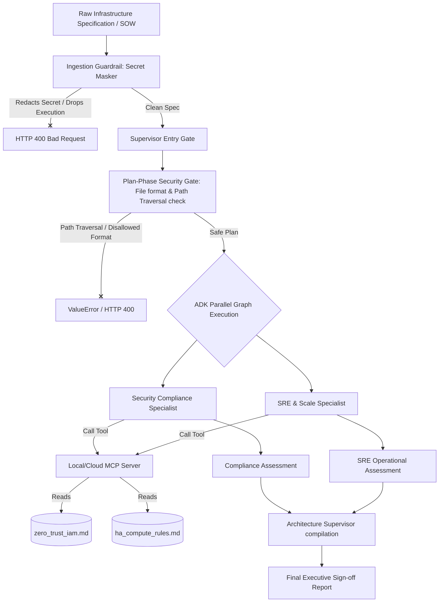

# 🛡️ Triad Sentinel

Triad Sentinel is an enterprise-grade, multi-agent AI system designed to automatically audit cloud architecture blueprints and Infrastructure-as-Code (IaC) templates for security compliance, site reliability engineering (SRE) baselines, and cost optimization. 

Built using the **Google Agent Development Kit (ADK)** and targeting **Vertex AI Agent Engine (Reasoning Engines)**, the system implements zero-trust boundaries, pre-run secret interception, and multi-agent consensus routing.

---

## 🏢 System Architecture & Workflow

The system is structured as a directed graph workflow orchestrating parallel specialist reviews under a supervisor compilation gate.



---

## 🤖 Multi-Agent Orchestration Design

The system uses three highly specialized agents working in concert to evaluate architectural specifications:

1. **Senior Enterprise Architecture Supervisor (`architecture_supervisor`):**
   * **Role:** Orchestration, routing logic, and aggregation.
   * **Responsibilities:** Receives the original proposal, routes it through parallel specialist paths, collects raw markdown reports, and synthesizes findings into a unified executive dashboard without altering specialists' inputs.
   * **Tools:** Integrates the STRIDE threat modeling analyzer to perform deep threat assessments.

2. **Security Compliance Specialist (`security_compliance_specialist`):**
   * **Role:** Zero-trust validator.
   * **Responsibilities:** Leverages `zero_trust_iam.md` via the Model Context Protocol (MCP) to verify identity controls (IAM wildcards), network perimeters (public routing tables, SSH/RDP exposures), and data encryption (KMS, TLS 1.3).

3. **SRE & Scale Specialist (`sre_scale_specialist`):**
   * **Role:** Reliability and cost optimizer.
   * **Responsibilities:** Leverages `ha_compute_rules.md` via MCP to identify single points of failure (SPOFs), auto-scaling policies, observability requirements, and bloated provisioning (cost efficiency).

---

## 🔒 Security Gates & Guardrails

The solution enforces a defense-in-depth model with multiple pre-execution validation gates:

### 1. Ingestion Phase: Secret Masking Guardrail
* **Location:** `src/guardrails/secret_masker.py`
* **Logic:** Intercepts incoming requests before reaching downstream models. Scans for high-risk exposed patterns (e.g. AWS Keys, Google API Keys, RSA Private Keys).
* **Action:** Instantly redacts the secret to shield downstream logs, print a security alert, drops execution, and returns a structured `CRITICAL CONTEXT ERROR` response block.

### 2. Planning Phase: Local Security Gate
* **Location:** `src/agents/supervisor.py` (`on_plan_phase`)
* **Logic:** A callback hook executed before invoking downstream LLMs. It parses candidate paths and file formats referenced in the architecture specification.
* **Action:** Blocks unauthorized directory traversals outside the local workspace root and rejects disallowed configuration formats (e.g. `.xml`, `.ini`, `.conf`) by raising a `ValueError`.

---

## 🛠️ Custom Agent Skills & Tools

The platform provides agents with custom programmatic skills to analyze plans:

* **Plan Parser (`parse_infrastructure_plan`):**
  Located in `src/tools/plan_parser.py`, this tool parses raw IaC templates, JSON, YAML, or SOW markdown descriptions. It identifies compute, networking, CIDR ranges, database components, and exports them as structured JSON blocks.
* **STRIDE Analyzer (`analyze_stride`):**
  Located in `src/tools/stride_analyzer.py`, this tool performs threat modeling against the architecture design to identify risks spanning Spoofing, Tampering, Repudiation, Information Disclosure, Denial of Service, and Elevation of Privilege.

---

## 🔌 Model Context Protocol (MCP) Integration

Rather than hardcoding compliance standards inside prompt templates, the specialist agents dynamically call a local **Model Context Protocol (MCP) Server** running at `http://127.0.0.1:8001`.

* **Resource URI Scheme:** Uses `policy://[filename]` to surface markdown documentation files in `/policies` dynamically as resources.
* **Baseline Tool:** Exposes `fetch_policy_baseline` to allow agents to fetch the exact policy standard file (e.g. `zero_trust_iam.md` or `ha_compute_rules.md`) dynamically, eliminating model hallucinations.

---

## 🚀 SRE CI/CD Automation

A robust, production-ready GitHub Actions deployment pipeline is configured in `.github/workflows/deploy.yml`:

1. **Automated Verification Gate:** Runs the `pytest` test suite on every push to verify the code quality and security policies.
2. **Secure Authentication:** Connects to Google Cloud using modern **OpenID Connect (OIDC) / Workload Identity Federation**, removing the need for long-lived static service account keys in repository secrets.
3. **Manual Deployment:** Deployment to Vertex AI Agent Engine is an on-demand, manual process triggered via the GitHub Actions UI (workflow_dispatch) rather than running automatically on every push.

To prevent unnecessary compute costs and secret injection errors, the deployment pipeline is decoupled from the automated testing pipeline. Automated testing (pytest) runs on every push, while production deployment requires manual approval via the GitHub Actions tab.

---

## 🧪 Verification & Test Suite

The test suite in `tests/test_agents.py` covers all core security rules and executes cleanly in a local Windows PowerShell environment.

### Test Scenarios Covered
1. **Secret Masking Guardrail:** Passes unmasked AWS & Google API key strings. Asserts that the guardrail drops execution early and returns the structured error block.
2. **Safe Architecture Processing:** Passes a compliant spec, asserting it clears the guardrail without blockage.
3. **Plan-Phase Gate Interception:** Passes unauthorized directory traversal paths and disallowed XML formats, asserting that `ValueError` is raised.
4. **API Endpoint Integration:** Uses FastAPI `TestClient` to make POST requests to `/triage` and asserts proper status codes and JSON outputs under masked environments.

### Execution Command
Run the tests inside the virtual environment:
```powershell
.venv\Scripts\pytest.exe tests/
```
